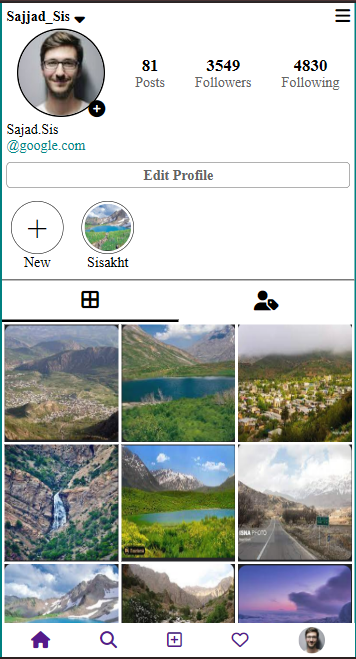

# Instagram Clone


## Overview

This project is an **Instagram clone** that mimics the basic layout and user interface of the Instagram profile page. It is intended as a **portfolio project** to demonstrate HTML, CSS, and JavaScript skills, and includes static elements like profile details, images, and icons.

## Screenshots



## Prerequisites

Before you begin, ensure you have met the following requirements:

- A modern web browser (e.g., Chrome, Firefox, Safari)
- Basic knowledge of HTML, CSS, and JavaScript

## Installation

1. **Clone the repository:**

   ```bash
   git clone https://github.com/sajjad-sisakhtpour/instagram.git
   ```

2. **Navigate to the project directory:**

   ```bash
   cd instagram
   ```

3. **Open the project in your browser:**
   Open `index.html` in any web browser to view the Instagram profile page layout.

## Usage

- The project simulates a profile page where static elements like profile photo, posts, followers, and following counts are displayed.
- This is a non-interactive static layout for demonstration purposes.

## Examples

You can explore various elements of the project to see how they are implemented:

- **Profile header** shows username and profile options.
- **Posts grid** showcases image thumbnails in a three-column layout.
- **Footer navigation** mimics typical Instagram navigation icons.

## Documentation

### File Structure

- **index.html** - Main HTML file containing the page structure.
- **style.css** - CSS file for styling the layout.
- **screenshots/** - Folder containing screenshots of the project.

### Key Features

1. **Responsive Design**: The layout is optimized for mobile display (width: 400px).
2. **CSS Grid**: The posts section uses CSS Grid for a three-column layout.
3. **Font Awesome Icons**: Utilizes Font Awesome icons for profile and footer elements.

## Contributing

Contributions are always welcome! Here’s how you can help:

1. Fork the repository.
2. Create a new branch (`git checkout -b feature/YourFeature`).
3. Make your changes and commit them (`git commit -m 'Add your feature'`).
4. Push to the branch (`git push origin feature/YourFeature`).
5. Create a Pull Request.

## License

This project is licensed under the MIT License - see the [LICENSE](LICENSE) file for details.

## Contact

**Sajjad Sisakhtpour**

- **Email**: [sajjad.sisakhtpour@gmail.com](mailto:sajjad.sisakhtpour@gmail.com)
- **GitHub**: [github.com/sajjad-sisakhtpour](https://github.com/sajjad-sisakhtpour)
- **LinkedIn**: [ir.linkedin.com/in/sajad-sisakht-pour](https://ir.linkedin.com/in/sajad-sisakht-pour)

## Live Demo

For a live demonstration, open the project on a local web server or view the layout by opening the `index.html` file directly in your browser.
